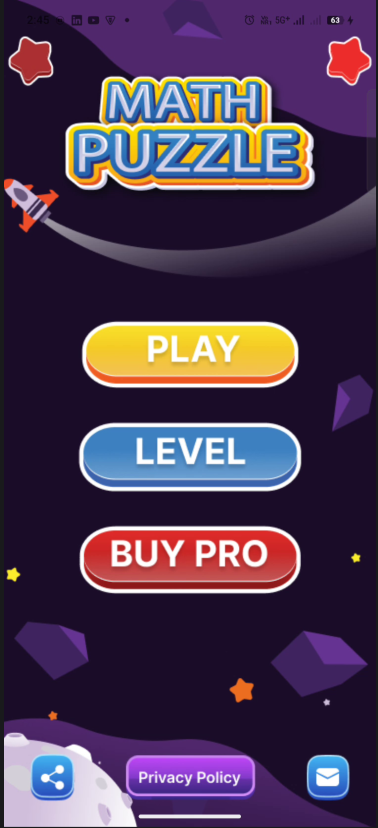
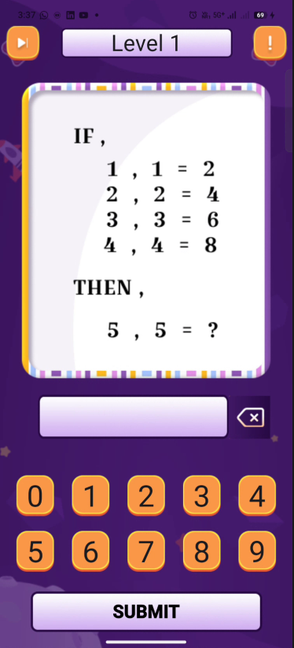
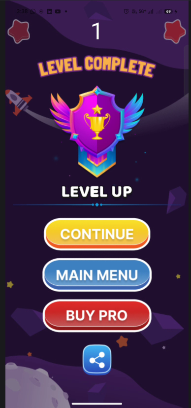
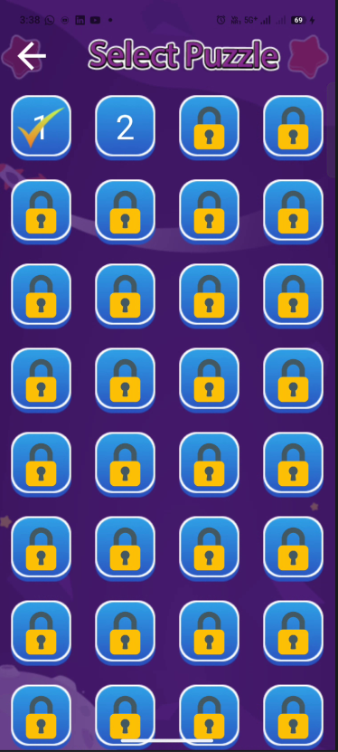

# 🧠 Math Puzzle – Flutter Game App

**Math Puzzle** is an engaging and colorful puzzle game built with **Flutter**, designed to improve logical thinking and mathematical skills through fun and interactive challenges.  
The app features multiple levels, smooth animations, and a clean UI suitable for all age groups.

---

## 🚀 Features

- 🎮 Interactive math-based puzzle levels  
- 🧩 Progressive level unlocking system  
- ✨ Attractive UI with smooth animations  
- 🏆 Level completion & reward screen  
- 🔐 Locked levels system for progression  
- 💎 Pro version option (Buy Pro)  
- 📱 Fully responsive mobile UI  

---

## 📸 Screenshots

  
  
  
  

---

### 🏠 Home Screen
Displays the game title with options to **Play**, **Select Level**, or **Buy Pro**.

---

### 🧮 Puzzle Screen
Solve logical math problems using the on-screen numeric keypad.

---

### 🎉 Level Complete Screen
Shown after completing a level, with options to continue or return to the main menu.

---

### 🗂️ Select Puzzle Screen
Choose unlocked levels and view locked ones to track progress.

---

## 🛠️ Built With

- **Flutter** – UI framework  
- **Dart** – Programming language  
- **Material Design** – UI components  

---
